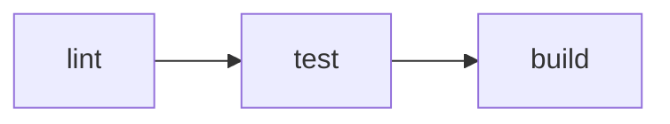

# 运行

`vp run` 会执行 `package.json` 中定义的脚本以及 `vite.config.ts` 中定义的任务。它的工作方式类似于 `pnpm run`，但内置了缓存、依赖排序和 workspace 感知执行功能。

::: tip
`vpr` 是 `vp run` 的独立简写形式。以下所有示例都适用于 `vp run` 和 `vpr`。
:::

## 概述

使用 `vp run` 执行现有的 `package.json` 脚本：

```json [package.json]
{
  "scripts": {
    "build": "node compile-legacy-app.js",
    "test": "jest"
  }
}
```

`vp run build` 执行对应的构建脚本：

```
$ node compile-legacy-app.js

为生产环境构建旧版应用...

✓ 构建完成，用时 69 秒
```

不指定任务名称直接运行 `vp run` 可进入交互式任务选择器：

```
选择一个任务（↑/↓，Enter 执行，Esc 清除）：

  › build: node compile-legacy-app.js
    test: jest
```

## 缓存

默认情况下不会缓存 `package.json` 脚本。使用 `--cache` 启用缓存：

```bash
vp run --cache build
```

```
$ node compile-legacy-app.js
✓ 构建完成，用时 69 秒
```

如果没有变化，下次运行时输出会从缓存中重放：

```
$ node compile-legacy-app.js ✓ 命中缓存，正在重放
✓ 构建完成，用时 69 秒

---
vp run: 命中缓存，节省了 69 秒。
```

如果有输入发生变化，任务会重新运行：

```
$ node compile-legacy-app.js ✗ 未命中缓存：'legacy/index.js' 已修改，正在执行
```

## 任务定义

Vite 任务会自动追踪你的命令使用了哪些文件。你可以在 `vite.config.ts` 中直接定义任务，以默认启用缓存或控制影响缓存行为的文件和环境的变量。

```ts
import { defineConfig } from 'vite-plus';

export default defineConfig({
  run: {
    tasks: {
      build: {
        command: 'vp build',
        dependsOn: ['lint'],
        env: ['NODE_ENV'],
      },
      deploy: {
        command: 'deploy-script --prod',
        cache: false,
        dependsOn: ['build', 'test'],
      },
    },
  },
});
```

如果你想直接运行现有的 `package.json` 脚本，请使用 `vp run <script>`。如果你需要任务级别的缓存、依赖关系或环境/输入控制，请使用显式的 `command` 定义任务。任务名称可以来自 `vite.config.ts` 或 `package.json`，但不能同时来自两者。

::: info
在 `vite.config.ts` 中定义的任务默认启用缓存。`package.json` 脚本则不会。完整的解析顺序请参见 [何时启用缓存？](/guide/cache#when-is-caching-enabled)。
:::

完整的 `run` 块参考请参见 [运行配置](/config/run)。

## 任务依赖

使用 [`dependsOn`](#depends-on) 以正确的顺序运行任务。运行 `vp run deploy` 时会先执行 `build` 和 `test`。依赖项也可以使用 `package#task` 符号引用同一项目中的其他包：

```ts
dependsOn: ['@my/core#build', '@my/utils#lint'];
```

## 在 Workspace 中运行

不带包选择标志时，`vp run` 会在当前工作目录所在的包中运行任务：

```bash
cd packages/app
vp run build
```

你也可以从任何位置显式指定目标包：

```bash
vp run @my/app#build
```

工作区包的顺序基于各包 `package.json` 中声明的常规单体仓库依赖关系图。换句话说，当 Vite+ 提及包依赖时，指的是工作区包之间的常规 `dependencies` 关系，而不是与任务运行器相关的独立图谱。

### 递归（`-r`）

按依赖顺序在每个工作区包中运行任务：

```bash
vp run -r build
```

该依赖顺序来自通过 `package.json` 依赖引用的工作区包。

### 传递（`-t`）

在一个包及其所有依赖项中运行任务：

```bash
vp run -t @my/app#build
```

如果 `@my/app` 依赖于 `@my/utils`，而 `@my/utils` 又依赖于 `@my/core`，则会按顺序运行这三个包。Vite+ 会从 `package.json` 中声明的正常工作区包依赖关系解析这个链。

### 过滤（`--filter`）

按名称、目录或通配符模式选择包。语法与 pnpm 的 `--filter` 相同：

```bash
# 按名称
vp run --filter @my/app build

# 按通配符
vp run --filter "@my/*" build

# 按目录
vp run --filter ./packages/app build

# 包含依赖项
vp run --filter "@my/app..." build

# 包含被依赖项
vp run --filter "...@my/core" build

# 排除包
vp run --filter "@my/*" --filter "!@my/utils" build
```

多个 `--filter` 标志会合并为并集。排除过滤器在所有包含之后应用。

### 工作区根目录（`-w`）

显式在工作区根包中运行任务：

```bash
vp run -w build
```

## 复合命令

用 `&&` 连接的命令会被拆分为独立的子任务。启用缓存时，每个子任务会单独缓存。这适用于 `vite.config.ts` 任务和 `package.json` 脚本：

```json [package.json]
{
  "scripts": {
    "check": "vp lint && vp build"
  }
}
```

现在运行 `vp run --cache check`：

```
$ vp lint
发现 0 个警告和 0 个错误。

$ vp build
✓ 构建完成，用时 28 毫秒

---
vp run: 0/2 命中缓存（0%）。
```

每个子任务都有独立的缓存条目。如果只更改了 `.ts` 文件但 lint 仍通过，则下次运行 `vp run --cache check` 时只会重新运行 `vp build`：

```
$ vp lint ✓ 命中缓存，正在重放
$ vp build ✗ 未命中缓存：'src/index.ts' 已修改，正在执行
✓ 构建完成，用时 30 毫秒

---
vp run: 1/2 命中缓存（50%），节省了 120 毫秒。
```

### 嵌套的 `vp run`

当命令包含 `vp run` 时，Vite 任务会将其内联为独立任务，而不是生成嵌套进程。每个子任务独立缓存，输出保持扁平化：

```json [package.json]
{
  "scripts": {
    "ci": "vp run lint && vp run test && vp run build"
  }
}
```

运行 `vp run ci` 会展开为三个任务：



标志也适用于嵌套脚本。例如，脚本中的 `vp run -r build` 会展开为每个包的独立构建任务。

::: info
单体仓库中常见的模式是在根脚本中递归运行任务：

```json [package.json (root)]
{
  "scripts": {
    "build": "vp run -r build"
  }
}
```

这可能导致递归：根 `build` -> `vp run -r build` -> 包含根 `build` -> ...

Vite Task 会检测到这种情况并自动剪枝自引用，确保其他包正常构建。
:::

## 执行摘要

使用 `-v` 显示详细的执行摘要：

```bash
vp run -r -v build
```

```
━━━━━━━━━━━━━━━━━━━━━━━━━━━━━━━━━━━━━━━━━━━━━━━
    Vite+ 任务运行器 • 执行摘要
━━━━━━━━━━━━━━━━━━━━━━━━━━━━━━━━━━━━━━━━━━━━━━━

统计信息：   3 个任务 • 3 次命中缓存 • 0 次未命中缓存
性能：  100% 命中缓存率，总计节省 468 毫秒

任务详情：
────────────────────────────────────────────────
  [1] @my/core#build: ~/packages/core$ vp build ✓
      → 命中缓存 - 输出已重放 - 节省 200 毫秒
  ·······················································
  [2] @my/utils#build: ~/packages/utils$ vp build ✓
      → 命中缓存 - 输出已重放 - 节省 150 毫秒
  ·······················································
  [3] @my/app#build: ~/packages/app$ vp build ✓
      → 命中缓存 - 输出已重放 - 节省 118 毫秒
━━━━━━━━━━━━━━━━━━━━━━━━━━━━━━━━━━━━━━━━━━━━━━━
```

使用 `--last-details` 可在不重新运行任务的情况下显示上次运行的摘要：

```bash
vp run --last-details
```

## 并发

默认情况下，最多同时运行 4 个任务。使用 `--concurrency-limit` 更改此限制：

```bash
# 一次最多运行 8 个任务
vp run -r --concurrency-limit 8 build

# 一次只运行一个任务
vp run -r --concurrency-limit 1 build
```

限制也可以通过环境变量 `VP_RUN_CONCURRENCY_LIMIT` 设置。`--concurrency-limit` 标志优先于环境变量。

### 并行模式

使用 `--parallel` 忽略任务依赖关系并以无限制的并发运行所有任务：

```bash
vp run -r --parallel dev
```

这在任务相互独立且需要最大吞吐量时非常有用。可以将 `--parallel` 与 `--concurrency-limit` 结合使用，以在不依赖顺序的情况下运行任务，但仍限制并发任务数：

```bash
vp run -r --parallel --concurrency-limit 4 dev
```

## 额外参数

在任务名称之后的参数会传递给任务命令：

```bash
vp run test --reporter verbose
```
