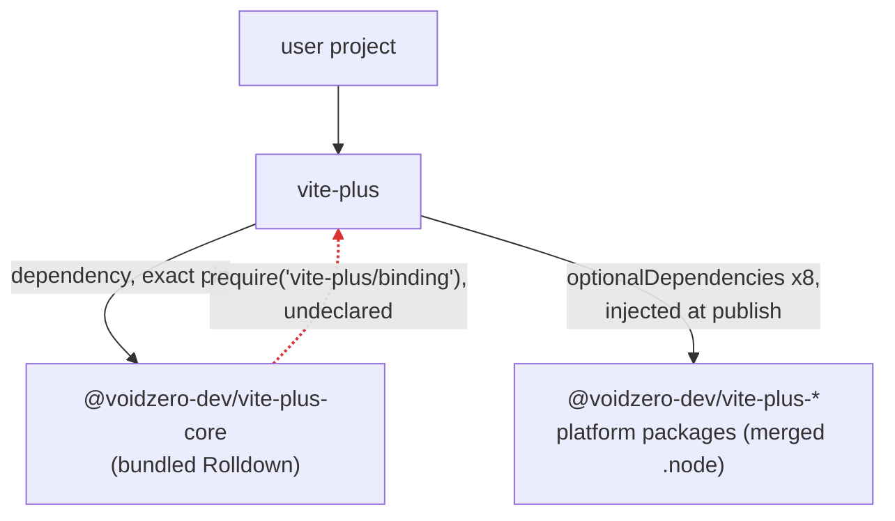
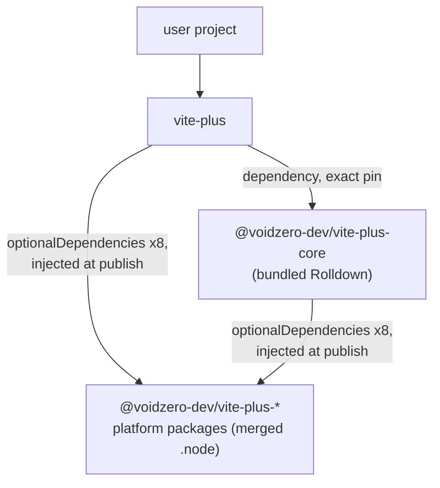

# RFC：通过平台包解析 Core 的 Rolldown 绑定

- Issue：[#2054](https://github.com/voidzero-dev/vite-plus/issues/2054)
- Supersedes：[#2067](https://github.com/voidzero-dev/vite-plus/pull/2067)（相同的重写方向，不同的版本连接方式）

## 问题

`@voidzero-dev/vite-plus-core` 的发布构建会将捆绑后的 Rolldown loader 中所有 `@rolldown/binding-*` require 都折叠为 `vite-plus/binding`。这会导致以下三个问题：

1. Core 从未声明 `vite-plus`，因此该 require 只能通过 pnpm 的隐藏提升解析，并形成一个未声明的循环依赖（`vite-plus -> core -> vite-plus/binding`）。pnpm 的 `enable-global-virtual-store` 和 Yarn PnP 会强制要求声明依赖，并因 `Cannot find module 'vite-plus/binding'` 而失败。复现地址：<https://github.com/jong-kyung/repro-vite-plus-2054>。
2. 在未安装 `vite-plus` 的情况下安装 Core（`"vite": "npm:@voidzero-dev/vite-plus-core@<version>"` 别名）时，完全无法加载 Rolldown。
3. 这种折叠重写会将每个版本检查分支都转换为 `require('vite-plus/binding/package.json')`，从而抛出 `ERR_PACKAGE_PATH_NOT_EXPORTED`（`vite-plus` 没有导出这样的子路径）。所有平台分支都会失败，而 binding 只能通过被重写后的 WASI 回退分支加载，跳过版本检查。

PR #2067 通过按平台进行重写修复了问题 1-2，但将精确固定版本的平台 `optionalDependencies` 提交到了 `packages/core/package.json` 中。这与发布模型相冲突：`prepare_release.yml` 只会更新 `version` 字段，`mergePackageJson()` 加上 CI 的脏树检查会因过期的固定版本而失败，仓库锁文件会将已发布的 binding 拉入开发工作区，而预览构建则会固定到上一个发布版本。

流水线已经为 `vite-plus` 自身解决了这个问题：napi-rs 的 `prePublish` 会在发布时注入精确固定版本的 `@voidzero-dev/vite-plus-<platform>` 条目，而提交到仓库中的 package.json 不包含这些条目。

## 包图

已发布的版本产物；实线表示已声明的依赖，虚线表示未声明的运行时 require。

### 之前

### 之后

没有新增软件包，没有循环依赖，并且 core 可以独立工作。包管理器会对共享的平台软件包进行去重，因此不会重复下载。

## 设计

所有更改均应用于发布产物；开发构建仍保留 `@rolldown/binding-*`，并加载嵌入 dist 中的 `.node`。

1. **按平台重写**（`packages/core/build-support/rewrite-rolldown-binding.ts`）：对于通过 napi-rs `parseTriple` 从 CLI 的 `napi.targets` 推导出的后缀，将 `@rolldown/binding-<suffix>` 转换为 `@voidzero-dev/vite-plus-<suffix>`。引入平台包时，通过其 `main` 返回合并后的 `.node`，形态与 Rolldown 自身的绑定包相同。其他平台（android、freebsd、`wasm32-wasi`、`darwin-universal`、WebContainer 回退方案）仍使用 `@rolldown/binding-*`。
2. **将版本检查限定在被重写的分支中**：每个加载器分支都将其 require 与版本检查配对（`bindingPackageVersion !== "<rolldown version>"`，在 `NAPI_RS_ENFORCE_VERSION_CHECK` 下强制执行）。转换器在一个以重写后 specifier 为锚点的模式中，将检查所需的版本重写为 core 的版本，因此未修改的分支仍保留上游检查，且 Rolldown 的公开 `VERSION` 导出仍为 Rolldown 版本。平台包与 core 锁步发布，使版本检查再次成为真正有效的检查。如果任何已发布的平台后缀缺少对应的加载器分支，或 specifier 与版本检查的重写结果不一致，构建将失败，从而避免 napi-rs 加载器格式变化导致不完整的重写进入发布版本。
3. **在发布时注入 optionalDependencies**（`packages/cli/publish-native-addons.ts`）：napi-rs 的 `prePublish` 注入 CLI 的平台固定版本后，将完全相同的条目同步注入 `packages/core/package.json`；如果缺少任何目标，则失败。该脚本在 core 打包前的两种流程中都会运行：发布流程（`--mode npm`，平台包先发布，因此固定版本可以解析）和 registry-bridge 预览流程（`--mode pkg-pr-new`，固定版本与 bridge 提供的版本一致）。任何固定版本都不会写入已提交的文件。
4. **在发布构建中写入 core 的版本**（`reusable-release-build.yml`）：在已有的 CLI 版本写入逻辑旁，将 `packages/core/package.json` 写入 `VERSION`，从而使内置的版本检查与已发布的平台包匹配。对于正式发布是空操作，对于预览发布则可修复问题。
5. **移除导出**：`vite-plus/binding` 导出仅用于已合并的重写逻辑。没有任何内容导入该 specifier（CLI 使用相对路径加载其绑定；仓库、dist 或生态系统中均无相关引用），因此移除该导出。旧版已发布的 core 若需要它，始终会通过精确的版本固定与旧版 `vite-plus` 配对，因此移除该导出不会使它们失去依赖。

未改变的部分：开发构建、本地 registry 和 e2e（它们安装由开发构建生成的 core）、`prepare_release.yml`、`mergePackageJson()`、仓库 lockfile。

## 替代方案

- **提交固定版本（PR #2067）**：需要在发布时重新固定版本、添加锁文件条目，以及仅用于补偿提交发布流水线已知值的“固定版本与版本号匹配”测试。
- **中立加载器包 `@voidzero-dev/vite-plus-binding`**：依赖关系图最简洁，并支持原生 napi-rs 注入，但会增加第九个需要同步发布的包，还需要将 napi 打包从 `packages/cli/binding/` 移出，而本地 CLI、bootstrap、pack-local 和 preview 流程都依赖该目录。相比声明现有平台包，不会带来任何额外的解析特性；如果将来有第三个包需要该 binding，再重新考虑。
- **在 `vite-plus` 上使用可选的 peer 依赖（#2053）**：声明了循环依赖，而不是移除它；独立的 core 仍然无法正常工作。
- **将 `.node` 文件随发布版 core 一起发布**：重复包含了平台包用于去重的原生插件。

## 测试

1. 针对捕获的 loader 片段测试转换：重写受支持的分支（specifier 加 guard），不修改不受支持的分支和 WASI 分支，第二次处理时结果保持稳定。
2. 当注入的 pin 未覆盖每个 `napi.target` 时，发布脚本会失败。
3. 布局解析规范（`binding-resolution-layout.spec.ts`）：使用存根包重建全局虚拟存储布局，并断言折叠后的重写会因 `Cannot find module 'vite-plus/binding'` 失败，而转换输出可以解析，且其 guard 会拒绝平台不匹配的包。PTY 快照用例无法覆盖此场景：快照安装使用开发构建的 core，其中将 `.node` 嵌入 dist，因此不会经过重写路径。
4. 全栈回归测试：将打包的发布产物安装到一个启用了 `enable-global-virtual-store=true` 的项目中，并通过 `@voidzero-dev/vite-plus-core/rolldown` 进行打包。该测试仅对 `RELEASE_BUILD` 产物有意义，因此应归入预览流水线。#2054 中的复现用例就是验收测试。

在正常版本发布中随附；消费者无需采取任何操作。

## 待解决问题

1. napi-rs 是否应该支持将平台的 `optionalDependencies` 注入多个包中？值得向上游提交 issue；这样可以替代设计 3 中脚本侧的镜像。
2. 布局回归测试的运行位置：预览流水线（拟议方案）、发布 PR 的预检，还是选择性启用的 `RELEASE_BUILD=1` 端到端测试环节。
