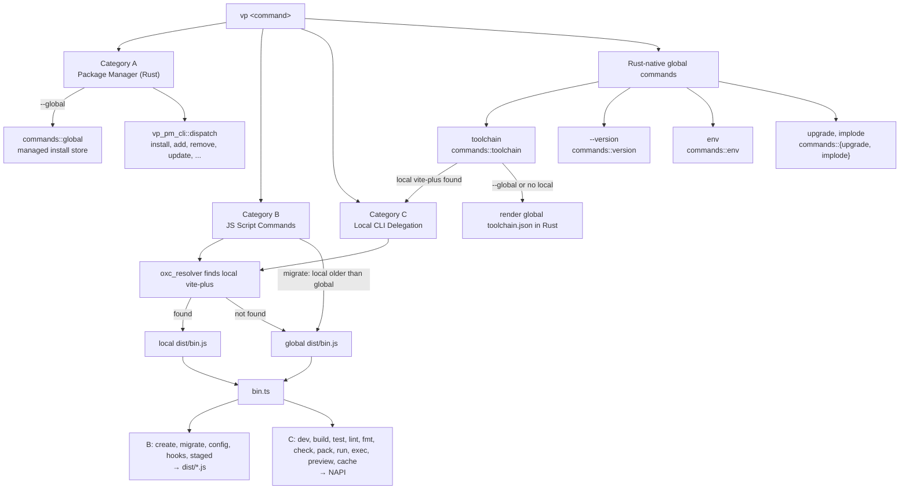

# RFC：将全局和本地 CLI 合并为单一包

## 背景

此前，CLI 被拆分为两个 npm 包：

- **`vite-plus`**（`packages/cli/`）——本地 CLI，作为项目的开发依赖安装。通过 Rust 的 NAPI 绑定处理 build、test、lint、fmt、run 以及其他任务类命令。
- **`vite-plus-cli`**（`packages/global/`）——全局 CLI，安装到 `~/.vite-plus/`。处理 create、migrate、version 以及包管理器相关命令。它有自己独立的 NAPI 绑定 crate、rolldown 构建、安装脚本和 snap 测试。

Rust 二进制文件 `vp`（`crates/vp_global_cli/`）作为入口点，委托给 `packages/global/dist/index.js`，后者检测本地的 `vite-plus` 安装，并相应地转发命令。

**双包方案的问题：**

1. 两套独立的 NAPI 绑定 crate，且依赖有重叠
2. 两条独立的构建流水线（本地使用 tsc，全局使用 rolldown）
3. 需要发布和版本管理两个 npm 包
4. 一个用于检测/安装本地 vite-plus 的 JS shim 层（`dist/index.js`）
5. 复杂的 CI 工作流，需要同时构建、测试并发布两个包
6. 跨包重复的工具函数和类型

## 目标

1. 将 `packages/global/`（`vite-plus-cli`）合并进 `packages/cli/`（`vite-plus`）
2. 发布单一 npm 包：`vite-plus`
3. 统一 NAPI 绑定 crate
4. 用通过 `oxc_resolver` 进行的直接 Rust 解析替换 JS shim
5. 简化 CI 构建与发布流水线
6. 保持所有现有功能正常工作。

## 架构（合并后）

### 单一包：`packages/cli/`（`vite-plus`）

```
packages/cli/
├── bin/vp                    # Node.js 入口脚本
├── binding/                  # 统一的 NAPI 绑定 crate（迁移、包管理器、工具）
├── src/
│   ├── bin.ts                # 本地与全局命令的统一入口
│   ├── create/               # vp create 命令（来自全局）
│   ├── migration/            # vp migrate 命令（来自全局）
│   ├── version.ts            # vp --version（来自全局）
│   ├── utils/                # 共享工具（来自 global-utils）
│   ├── types/                # 共享类型（来自 global-types）
│   ├── resolve-*.ts          # 本地 CLI 工具解析器
│   └── ...                   # 其他本地 CLI 源文件
├── dist/                     # tsc 输出（本地 CLI）
│   ├── bin.js                # 编译后的入口点
│   └── global/               # rolldown 输出（全局 CLI 代码块）
│       ├── create.js
│       ├── migrate.js
│       └── version.js
├── install.sh / install.ps1  # 全局安装脚本
├── templates/                # 项目模板
├── rules/                    # Oxlint 规则
├── snap-tests/               # 本地 CLI snap 测试
└── snap-tests-global/        # 全局 CLI snap 测试
```

### 全局安装目录（`~/.vite-plus/`）

全局安装目录采用 wrapper package 模式。每个版本目录都将 `vite-plus` 声明为 npm 依赖，而不是直接提取其内部文件。

这将 `vp` 二进制与 vite-plus 的内部文件布局解耦。

```
~/.vite-plus/
├── bin/
│   └── vp                            # 指向 current/bin/vp 的符号链接
├── current -> <version>/             # 指向活动版本的符号链接
├── <version>/
│   ├── bin/
│   │   └── vp                        # Rust 二进制（来自 CLI 平台包）
│   ├── package.json                  # Wrapper: { "dependencies": { "vite-plus": "<version>" } }
│   └── node_modules/
│       ├── vite-plus/                # 作为 npm 依赖安装
│       │   ├── dist/bin.js           # JS 入口点（由 Rust 二进制找到）
│       │   ├── dist/global/          # 打包后的全局命令
│       │   ├── binding/              # NAPI 加载器
│       │   ├── templates/            # 项目模板
│       │   ├── rules/                # Oxlint 规则
│       │   └── package.json          # 真正的 vite-plus package.json
│       ├── @voidzero-dev/            # 平台包（通过 optionalDeps）
│       │   └── vite-plus-<platform>/ # 包含 .node NAPI 二进制
│       └── [other transitive deps]
├── env, env.fish, env.ps1            # Shell PATH 配置
└── packages/                         # 全局安装的包（vp install -g）
```

**安装流程：**

- **生产环境**（`curl -fsSL https://vite.plus | bash`）：
  从 `@voidzero-dev/vite-plus-cli-{platform}` 下载 CLI 平台 tarball（只提取 `vp` 二进制），
  生成 wrapper `package.json`，运行 `vp install --silent`，由此通过 npm 安装 `vite-plus` + 所有传递依赖。

- **升级**（`vp upgrade`）：
  从 `@voidzero-dev/vite-plus-cli-{platform}` 下载 CLI 平台 tarball（仅二进制），
  生成 wrapper `package.json`，运行 `vp install --silent`。无需下载主 tarball。

- **本地开发**（`pnpm bootstrap-cli`）：
  复制 `vp` 二进制，生成 wrapper `package.json`，将 `node_modules/vite-plus` 符号链接到 `packages/cli/` 源码，同时将 `packages/cli/node_modules/` 中的传递依赖进行符号链接。

- **CI**（`pnpm bootstrap-cli:ci --tgz <path>`）：
  复制 `vp` 二进制，生成带有指向 tgz 文件的 `file:` 协议引用的 wrapper `package.json`，运行 `npm install`。

### 命令路由

Rust `vp` 二进制（`crates/vp_global_cli/`）使用 clap 解析每个命令（`crates/vp_global_cli/src/cli.rs`），并将其路由到以下路径之一：



- **类别 A（包管理器）**：`install`、`add`、`remove`、`update`、`dedupe`、`outdated`、`why`、`info`、`link`、`unlink`、`dlx`、`pm <subcmd>` — clap 定义和分发逻辑位于共享的 `crates/vp_pm_cli/` crate 中。全局 CLI 和本地 CLI binding 都会将 `vp_pm_cli::PackageManagerCommand` 展平到其顶层参数解析器中，并调用 `vp_pm_cli::dispatch` 来运行底层包管理器（pnpm/npm/yarn/bun）。从全局 `vp` 二进制运行时，这些命令完全由 Rust 中的 `run_package_manager_command` 处理，不会到达 `bin.ts`；只有直接调用本地 JavaScript 入口点时才会采用 NAPI 路径（例如 `npx vp install`）。全局 CLI 还会拦截 `--global` 投影（`PackageManagerCommand::managed_global_command`），在委托之前通过 `commands::global` 从 vite-plus 管理的安装存储中提供服务。
- **类别 B（JS 脚本命令）**：`create`、`migrate`、`config`、`hooks`、`staged` — 使用 JavaScript 实现。Rust 使用 `oxc_resolver` 查找项目本地的 `vite-plus/dist/bin.js`，并使用受管理的 Node.js 运行时运行它；如果不存在本地安装，则回退到全局安装中的 `dist/bin.js`。统一的 `bin.ts` 入口点随后会加载由 tsdown 打包的、对应命令的模块（入口在 `packages/cli/tsdown.config.ts` 中声明）。`migrate` 是本地优先解析规则的唯一例外：`JsExecutor::delegate_migrate` 会比较版本，如果项目的本地 `vite-plus` 版本低于全局 `vp`，则改为运行全局 CLI。
- **类别 C（本地 CLI 委托）**：`dev`、`build`、`test`、`lint`、`fmt`、`check`、`pack`、`run`、`exec`、`preview`、`cache` — 通过 `commands::delegate` 转发到本地 vite-plus CLI，该命令以与类别 B 相同的方式解析 `bin.js`；随后 `bin.ts` 将这些命令路由到 NAPI binding。`lint --init` 和 `fmt --init`/`--migrate` 会强制使用全局安装（`commands::delegate::execute_global`）。
- **Rust 原生全局命令**：其余顶层变体由全局二进制在 Rust 中处理。`env`、`upgrade` 和 `implode` 没有本地对应项；`--version` 和 `toolchain` 也存在于本地 CLI 中，当直接调用 JavaScript 入口点时会在那里执行（例如 `npx vp --version`）。
  - `toolchain`（`commands::toolchain`）是混合命令：当未指定 `--global` 且解析到项目本地的 `vite-plus` 时，它会像类别 C 一样委托给本地 CLI；否则（指定了 `--global` 或不存在本地安装）会直接在 Rust 中加载并渲染全局安装的 `toolchain.json`，而不是通过全局 `bin.js` 回退。
  - `--version`（`commands::version`）直接从 Rust 输出 `vp` 二进制版本和捆绑的工具版本；它永远不会到达 `bin.ts`。
  - `env`（`commands::env`）管理 Node.js 版本、shims 和 pins。
  - `upgrade` 和 `implode`（`commands::upgrade`、`commands::implode`）是用于管理 `vp` 二进制及其安装目录的自管理命令。

### 全局 scripts_dir 解析（Rust）

`vp` 二进制会根据自身位置自动检测 JS scripts 目录：

```rust
// 根据二进制位置自动检测
// ~/.vite-plus/<version>/bin/vp -> ~/.vite-plus/<version>/node_modules/vite-plus/dist/
let exe_path = std::env::current_exe()?;
let bin_dir = exe_path.parent()?;           // ~/.vite-plus/<version>/bin/
let version_dir = bin_dir.parent()?;        // ~/.vite-plus/<version>/
let scripts_dir = version_dir.join("node_modules").join("vite-plus").join("dist");
```

### 本地 vite-plus 解析（Rust）

```rust
// 使用 oxc_resolver 从项目目录解析 vite-plus/package.json
// 如果找到且 dist/bin.js 存在，则运行本地安装
// 否则回退到全局安装中的 dist/bin.js
fn resolve_local_vite_plus(project_path: &AbsolutePath) -> Option<AbsolutePathBuf> {
    let resolver = Resolver::new(ResolveOptions {
        condition_names: vec!["import".into(), "node".into()],
        ..ResolveOptions::default()
    });
    let resolved = resolver.resolve(project_path, "vite-plus/package.json").ok()?;
    let pkg_dir = resolved.path().parent()?;
    let bin_js = pkg_dir.join("dist").join("bin.js");
    if bin_js.exists() { AbsolutePathBuf::new(bin_js) } else { None }
}
```

### 统一入口点（`bin.ts`）

```typescript
// 全局命令 — 由 dist/global/ 中的 rolldown 打包模块处理
if (command === 'create') {
  await import('./global/create.js');
} else if (command === 'migrate') {
  await import('./global/migrate.js');
} else if (command === '--version' || command === '-V') {
  await import('./global/version.js');
} else {
  // 其他所有命令 — 通过 NAPI 绑定委托给 Rust 核心
  run({ lint, pack, fmt, vite, test, doc, resolveUniversalViteConfig, args });
}
```

## 变更摘要

### 已完成

1. **已将所有源代码合并** 从 `packages/global/` 到 `packages/cli/`：
   - `src/create/`、`src/migration/`、`src/version.ts` — 全局命令
   - `src/utils/`、`src/types/` — 共享工具和类型（从 `global-utils`、`global-types` 重命名而来）
   - `binding/` — 统一的 NAPI crate，包含 migration、package_manager、utils 模块
   - `install.sh`、`install.ps1` — 安装脚本
   - `templates/`、`rules/` — 资源文件
   - `snap-tests-global/` — 全局 snap 测试

2. **已彻底删除 `packages/global/`**

3. **已更新 Rust `vp` 二进制**（`crates/vp_global_cli/`）：
   - 添加 `oxc_resolver` 依赖，用于直接解析本地 vite-plus
   - 移除 JS shim 层 — 不再需要 `dist/index.js` 中间层
   - 将所有命令入口从 `index.js` 更新为 `bin.js`
   - 将 `MAIN_PACKAGE_NAME` 从 `vite-plus-cli` 修改为 `vite-plus`
   - 脚本目录解析：`version_dir/node_modules/vite-plus/dist/`

4. **已重构全局安装目录**（`~/.vite-plus/<version>/`）：
   - 包装器 `package.json` 声明 `vite-plus` 为依赖
   - `vite-plus` 由 npm 安装到 `node_modules/` 中（而不是从 tarball 解压）
   - `.node` NAPI 二进制通过 npm `optionalDependencies` 安装（不再手动复制）
   - 移除了 `extract_main_package()`、`strip_dev_dependencies()`、`MAIN_PACKAGE_ENTRIES`
   - 为升级命令新增了 `generate_wrapper_package_json()`
   - 简化安装脚本：只解压 `vp` 二进制并生成包装器
   - 简化 `install-global-cli.ts`：本地开发使用符号链接，CI 使用包装器

5. **已更新构建系统**：
   - 添加了 `rolldown.config.ts`，用于将全局 CLI 模块打包到 `dist/global/`
   - `treeshake: false` 是动态导入所必需的
   - 添加插件以修复 rolldown 输出中的 binding 导入路径
   - 简化了根目录 `package.json` 构建脚本（移除了 global 包步骤）

6. **已更新 CI/CD**：
   - 简化 `build-upstream` action（移除了 global 包构建步骤）
   - 简化 `release.yml`（移除了 global 包发布，现在是 3 个包而不是 4 个）
   - `get_cli_version()` 从 `node_modules/vite-plus/package.json` 读取

7. **移除了 `vite` 的 bin 别名** — 只保留 `vp` 二进制入口

8. **已更新 `package.json`**：
   - 新增运行时依赖：`cross-spawn`、`picocolors`
   - 新增来自 global 的 devDeps：`semver`、`yaml`、`glob`、`minimatch`、`mri` 等
   - 新增 `snap-test-global` 脚本
   - 新增 `files` 条目：`AGENTS.md`、`rules`、`templates`

9. **已更新文档**：`CLAUDE.md`、`CONTRIBUTING.md`

10. **已将 `vp` 二进制拆分为专用的 CLI 平台包**：
    - `@voidzero-dev/vite-plus-{platform}` 包现在只包含 `.node` NAPI 绑定（约 20MB）
    - `@voidzero-dev/vite-plus-cli-{platform}` 包现在只包含 `vp` Rust 二进制（约 5MB）
    - `publish-native-addons.ts` 分别创建并发布 NAPI 和 CLI 两类包
    - 安装脚本（`install.sh`、`install.ps1`）直接构造 CLI 包后缀，而不是查询 `optionalDependencies`
    - 升级注册表（`registry.rs`）直接查询 CLI 包，而不是查找 `optionalDependencies`
    - 减少了 `npm install vite-plus` 的下载体积（不再包含未使用的 `vp` 二进制）

11. **通过共享的 `vp_pm_cli` crate 将所有包管理器命令引入本地 CLI**：
    - 将每个包管理器命令（`install`、`add`、`remove`、`update`、`dedupe`、`outdated`、`why`、`info`、`link`、`unlink`、`dlx`、`pm <subcmd>`）的 clap 定义和分发器提取到 `crates/vp_pm_cli/`。`vp_global_cli` 和 `packages/cli/binding/` NAPI crate 都会将 `PackageManagerCommand` 展平到其顶层参数解析器中，并调用 `vp_pm_cli::dispatch`。
    - 此前，本地 CLI 绑定只支持 `install` 快捷方式；其他所有包管理器命令都会产生 clap 的“未知子命令”错误。现在，`npx vp add <pkg>`、`vp remove`、`vp pm publish` 等命令在全局和本地环境中的行为完全一致。
    - 全局 CLI 保留了针对 `--global` 路径的轻量包装器（`commands::env::global_install`），该包装器会在委托给 `vp_pm_cli::dispatch` 之前进行拦截。本地 CLI 则直接委托，并绕过 vite-task 调度器，因为包管理器操作不需要缓存。
    - 删除了各命令对应的模块 `crates/vp_global_cli/src/commands/{add,remove,install,update,dedupe,outdated,why,link,unlink,dlx,pm}.rs`。
    - 将每个命令各自一个具有代表性的 pnpm10 fixture 镜像到 `packages/cli/snap-tests/`，以锁定两者之间的一致性。

## 验证

- `cargo test -p vp_global_cli` — Rust 单元测试通过
- `pnpm -F vite-plus snap-test-local` — 本地 CLI 快照测试通过
- `pnpm -F vite-plus snap-test-global` — 全局 CLI 快照测试通过
- `pnpm bootstrap-cli` — 完整构建并成功进行全局安装
- `VP_VERSION=test bash packages/cli/install.sh` — 从 npm 进行生产环境安装成功
- 手动测试：`vp create`、`vp migrate`、`vp --version`、`vp build`、`vp test` 均运行正常。
