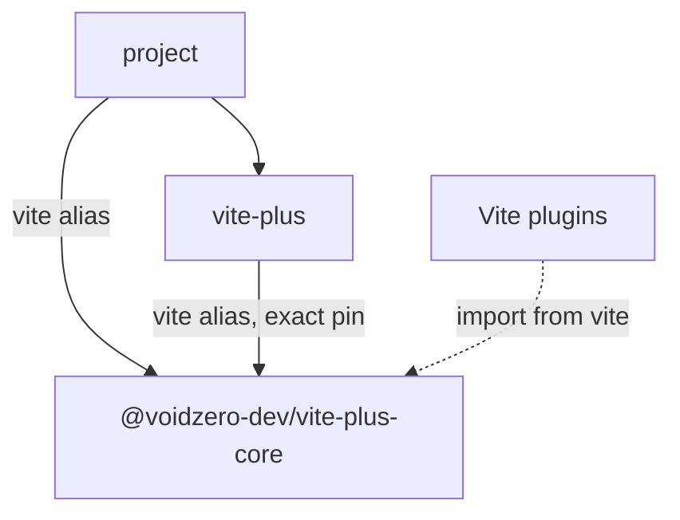

# RFC：通过一个依赖名称共享 Vite Core Runtime

- 状态：提议
- Issue：[＃1391](https://github.com/voidzero-dev/vite-plus/issues/1391)
- 相关：[Core package bundling](../packages/core/BUNDLING.md)、
  [CLI package bundling](../packages/cli/BUNDLING.md)、
  [Core binding resolution](./core-binding-resolution.md)

## 提案

在整个 `vite-plus` 中使用 `vite` 作为 Core Runtime 的依赖名称。
CLI 将依赖于指向 `@voidzero-dev/vite-plus-core` 的精确别名。其运行时导入、
公共重新导出以及生成的 shim 都将使用该别名。

这会将＃1391 中建议的依赖变更应用到 CLI 的 API 表面以及其命令解析器。
这样，用户插件和 CLI 就可以使用相同的名称解析同一个依赖。

## 问题

迁移后的项目可能有如下清单：

```json
{
  "devDependencies": {
    "vite": "npm:@voidzero-dev/vite-plus-core@0.3.0",
    "vite-plus": "0.3.0"
  },
  "overrides": {
    "vite": "npm:@voidzero-dev/vite-plus-core@0.3.0"
  }
}
```

`vite-plus` 包也会以其发布名称依赖 `@voidzero-dev/vite-plus-core`。
Bun 会安装两份副本：

```text
node_modules/vite/                          # project's alias
node_modules/@voidzero-dev/vite-plus-core/  # CLI's dependency
```

即使包版本匹配，Node 仍会将这些路径作为独立模块加载。`vp dev` 通过第二份副本创建服务器。TanStack Start 通过 `vite` 从第一份副本导入 `isRunnableDevEnvironment`。

Vite 使用 `environment instanceof RunnableDevEnvironment` 实现该守卫。
构造函数属于不同的模块实例，因此守卫返回 `false`。TanStack 会跳过其 SSR 中间件，
对 `/` 的请求返回 HTTP 404，并显示 `Cannot GET /`。

公共的 `vite-plus` 入口点也会重新导出第二份副本。将命令解析器改为启动第一份副本会反转这一不匹配：TanStack 的守卫通过，但由 `vite-plus` 导出的守卫失败。

## 目标和范围

对于 Vite+ 版本匹配且 peer 依赖兼容的项目，`vp dev`、从 `vite` 导入的内容以及由 `vite-plus` 导出的 Vite API 必须共享一个 Core Runtime。同样的规则适用于 ESM、CommonJS 和 module-runner 导出。

CLI 必须使用其声明的 Core 依赖，而不能依赖以规范包名称提升的副本。仅使用 `vite-plus` 的项目必须继续能够访问内置命令和公共 API。

本提案解决由别名和规范依赖名称导致的重复问题。包管理器仍可能在一个名称下安装不同版本或 peer 变体。验证计划涵盖这些布局；本 RFC 不提议进程级模块加载器 hook 或构造函数注册表。

## 设计

### 依赖声明

将 `packages/cli/package.json` 中 CLI 的 Core 依赖替换为 workspace 别名：

```json
{
  "dependencies": {
    "vite": "workspace:@voidzero-dev/vite-plus-core@*"
  }
}
```

发布打包器必须生成精确的 npm 别名。原型中使用的版本，其打包后的依赖为：

```json
{
  "dependencies": {
    "vite": "npm:@voidzero-dev/vite-plus-core@0.3.0"
  }
}
```

预览版和本地 registry 构建必须保留其对应的精确 Core 版本或工件引用。为这些流程添加打包断言；已提交的清单不得包含特定发布版本的固定版本号。

提议的依赖图如下：



该图描述了版本和 peer 上下文匹配时的目标状态。包管理器集成测试必须在受支持的布局中确认运行时身份。

### 导入和生成的导出

将引用 CLI Core 依赖的导入说明符从
`@voidzero-dev/vite-plus-core` 改为 `vite`，包括子路径：

| 源文件                                    | 必需变更                                                         |
| ----------------------------------------- | ---------------------------------------------------------------- |
| `packages/cli/src/index.ts`、`index.cts`  | 在两种模块格式中都通过 `vite` 重新导出 Vite API                  |
| `packages/cli/src/pack.ts`、`pack-bin.ts` | 通过 `vite/pack` 导入内置的 tsdown API                          |
| `packages/cli/build.ts`                   | 通过 `vite` 生成 module-runner、internal、client 和 type shim    |
| `packages/cli/src/define-config.ts`       | 更新类型导入并检查模块增强                                       |
| Migration 和构建元数据读取器              | 读取 CLI 的 Core 依赖时解析已声明的别名                          |

在构建辅助工具中，将依赖说明符与发布包身份分开。将
`@voidzero-dev/vite-plus-core` 保留为 npm 别名目标、版本检查、registry 记录和工具链元数据中的包名称。不要进行仓库范围的字符串替换。

在启用声明生成的情况下检查 `define-config.ts` 中的 `UserConfig` 增强。Vitest 也会增强 `vite`，因此实现必须同时检查两项增强，并保留公共 Vite+ 配置类型。保留显式的 `test?: VitestInlineConfig` 字段：即使项目有匹配的 Core 别名，npm 仍可能为 Vitest 安装单独的上游 Vite peer。

### 命令解析和版本检查

在启动由 Vite 支持的命令之前，相对于选定的 `vite-plus` 包解析 `vite`。该锚点必须与 CLI 的静态重新导出相匹配。优先选择项目副本可能会启动一个运行时，而 API 导出使用另一个运行时。

现有的 `resolveBundled()` 辅助函数优先使用 CLI 的位置，但允许回退到项目。对于必需的 Core 依赖，使用不带该回退的解析器。如果选定的包无法解析其已声明的别名，则报告安装不完整。

在调用 Core 专用命令入口之前，读取解析出的
`vite/package.json` 并检查：

1. 其 `name` 是 `@voidzero-dev/vite-plus-core`
2. 其版本与选定 CLI 预期的 Core 版本匹配
3. 该包中存在命令入口

检查必须区分 Core 包版本与其内置的 Vite 版本。例如，Core `0.3.0` 内置 Vite `8.2.2`。

在验证项目解析出的副本之前，检查最近的包清单中是否显式声明了 `vite` 依赖。如果该副本解析为上游 Vite 或不同的 Core 版本，则报告预期包和实际包及其位置。要求用户对齐别名并重新安装。仅声明 `vite-plus` 的项目会使用 CLI 的依赖，即使 npm 为 Vitest 提升了上游 Vite peer。不同 peer 上下文中的匹配版本需要使用下述布局验证；版本相等本身不能证明模块身份相同。

使用命令的执行目录进行项目验证，包括 `-C`、workspace 默认值和任务分派。对于 Vite 命令，从该目录解析位置参数中的根目录。将选定的 CLI 继续作为其必需依赖的锚点。

在 CLI 启动 Vite 或加载其打包入口之前应用这些检查。保留纯 `vite.defineConfig()` 与 Vite+ 配置辅助函数之间的区别，后者会注入 Vite+ 插件。

### 兼容性和安装

项目继续保留指向 `@voidzero-dev/vite-plus-core` 的 `vite` 别名。升级 CLI 并将现有别名对齐到同一版本后，包管理器即可生成提议的依赖图。本设计不需要新的别名目标。

CLI 的依赖仍然是必需且精确固定的。将其替换为 peer 依赖会使内置命令依赖用户的安装。

检查发布和预览打包器、本地 npm registry、工具链清单以及迁移元数据读取器中对规范名称解析的假设。保留独立 Core 安装及其原生 binding 解析。Yarn PnP 不是受支持的运行时布局。现有迁移器会将其转换为 `nodeLinker: node-modules`，如
[Yarn migration rules](../docs/guide/migrate-rules.md#yarn) 中所述。本提案保留该行为；不会增加 PnP 运行时支持。

通过其发布名称导入 Core 的消费者必须声明该依赖；不能依赖 CLI 通过提升机制暴露该依赖。

## 原型结果

调查使用了仓库提交
`b87593c580ed5d7c6932f60468df474909990f96` 以及
[issue reproduction](https://github.com/keyding/vite-plus-tanstack-start-ssr-broken/tree/2fc3db690c09fa877439b6d653641362e35f965e)。
实验使用了已发布的 Vite+ 和 Core `0.3.0` 工件、内置 Vite
`8.2.2`、TanStack Start `1.168.49`、Node `24.14.1` 和 macOS arm64。

依赖原型使用别名依赖重新打包 CLI，并重写其构建文件中的 Core 引用。全新安装产生了以下结果：

| 包管理器        | `GET /`  | 来自 `vite` 和 `vite-plus` 的相同环境守卫 |
| --------------- | -------- | ----------------------------------------- |
| Bun `1.4.2`     | HTTP 200 | 是                                        |
| npm `11.11.0`   | HTTP 200 | 是                                        |
| pnpm `10.30.1`  | HTTP 200 | 是                                        |

API 探测确认了 ESM 和 CommonJS 中 `createServer`、`mergeConfig`、`DevEnvironment`、可运行工厂以及两个环境守卫的身份一致性。module-runner 导出也共享 `ModuleRunner`。纯 Vite `defineConfig()` 保留了其身份函数行为。

一个专门的 `vp test` 用例通过。导入打包 API 并运行
`vp pack --help` 也成功。这些实验证明了可行性；它们没有构建提议的源代码变更，也没有运行完整的构建、迁移、类型和生态系统测试套件。

## 替代方案

### 仅更改 CLI 解析器

启动项目的别名后，复现结果返回 HTTP 200。但 Core 守卫随后返回 `false`，因此 CLI 的公共重新导出仍然与活动服务器不一致。正因如此，依赖和导出变更都是本 RFC 的一部分。

### 在上游 Vite 中共享标记

Vite 可以使用 `Symbol.for(...)` 键标记 `RunnableDevEnvironment` 和
`FetchableDevEnvironment`，并让它们的守卫接受跨模块副本的这些标记。一个原型保留了两个物理副本，通过了 42 项检查，并恢复了 HTTP 200。这些检查涵盖了两个导入方向、子类、错误类型的环境，以及在不初始化惰性 runner 的情况下进行守卫检查。

这是一个有用的上游改进。它可以修复这些守卫，同时让其他构造函数身份和模块状态保持分离。旧的、未打补丁的守卫也无法识别来自另一个副本的标记。应将其作为单独的变更推进，并制定针对这些符号键的上游兼容性策略。

### 精简的 Vite 兼容包

可以新增一个别名目标，通过已声明的规范依赖重新导出 Core。CLI 将保留其当前依赖。一个转发包原型在 Bun `1.4.2`、npm `11.11.0` 和 pnpm `11.24.0` 中返回 HTTP 200，并共享运行时身份。

该设计需要新的已发布包、完整的 Vite 导出和类型、客户端资源处理，以及对迁移和发布工具的变更。如果更改 CLI 的依赖说明符导致实现无法解决兼容性问题，它仍然可以作为替代方案。

### 将 `vite` 别名到 `vite-plus`

别名 `npm:vite-plus@0.3.0` 恢复了 SSR，但会将
`vite.defineConfig({})` 变成返回带有注入插件的新对象的调用。它还增加了
`vite-plus` → `vitest/config` → `vite` 的导入循环。提议的设计保留了 `vite` 处纯 Vite API 的行为。

### 安装后符号链接修复

将规范 Core 目录指向别名可以修复该复现。支持这种修复需要处理重新安装、嵌套依赖布局以及不使用 `node_modules` 的包管理器。应声明预期的依赖图，而不是在安装后修复它。

## 实现和验证

将依赖、导入、生成的 shim 和解析器作为一次行为变更来实现。分开推出会暴露混合的运行时身份，或导致导入未声明的依赖。

通过[本地 npm registry](../CONTRIBUTING.md#test-vp-migrate--vp-create-through-a-local-npm-registry)使用打包后的源代码构建。Workspace 链接可能掩盖别名重复问题。向
[PTY snapshot suite](../crates/vp_cli_snapshots/tests/cli_snapshots/README.md) 添加 CLI 回归测试，并在相应的包测试中增加 API／类型覆盖。

| 区域                         | 必需覆盖范围                                                                                                                                             |
| ---------------------------- | -------------------------------------------------------------------------------------------------------------------------------------------------------- |
| SSR 回归                     | 原始 TanStack 复现和最新受支持的 TanStack；HTTP 200 且两个守卫都通过                                                                                       |
| 模块身份                     | ESM、CommonJS、module-runner 和 CLI 创建的环境共享预期 API                                                                                                 |
| 包布局                       | Bun、npm、pnpm、使用 `node_modules` 的 Yarn、现有的 PnP 到 `node_modules` 迁移、pnpm 全局虚拟存储，以及具有独立 peer 上下文的 monorepo                |
| 不带项目别名的 CLI           | 仅安装 `vite-plus`；从其必需依赖解析内置命令和公共 API                                                                                                     |
| 无效安装                     | 缺少依赖、上游 Vite 覆盖、过时的 Core 别名和版本不匹配会产生可操作的 CLI 错误                                                                             |
| 类型和命令                   | 生成的声明、Vite／Vitest 配置增强、`vp dev`、`vp build`、`vp preview`、`vp test` 和 `vp pack`                                                             |
| 分发                         | 发布、预览和本地 registry tarball 声明预期别名，并保留独立 Core binding 支持                                                                             |
| 升级                         | 使用新 CLI 和匹配的别名重新安装现有项目；执行迁移和版本同步                                                                                               |

发布门槛是一个在受支持布局中共享运行时身份的源代码构建安装。如果某个包管理器创建了破坏回归测试的独立 peer 变体，则应在发布前解决该情况，或修改本设计。

## 未决问题

1. 在受支持的 monorepo 布局中，CLI 的别名依赖和每个插件的 Vite peer 能否解析到同一个运行时？原型涵盖了单项目安装。
2. 当 CLI 与 Vitest 一起增强 `vite` 时，哪些现有配置类型需要变更？声明测试必须在发布前确定这一点。
3. 即使本依赖变更消除了＃1391 中的重复，是否仍应由单独的上游 Vite 变更添加共享环境标记？
